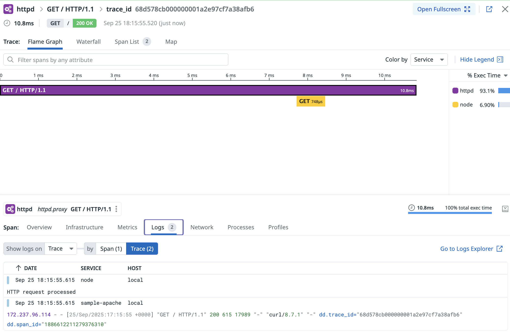

# httpd-datadog Examples

This directory contains a Docker Compose example demonstrating distributed tracing with the Apache httpd-datadog module.

## Overview

The example consists of three services:

- **Apache HTTP Server** - Reverse proxy with mod_datadog module for tracing
- **Node.js HTTP Service** - Simple HTTP server with dd-trace instrumentation  
- **Datadog Agent** - Collects and forwards traces to Datadog

## Architecture

```
Client → Apache (port 8888) → Node.js (port 8080) → Datadog Agent (port 8126)
```

## Prerequisites

Set your Datadog API key:
```bash
export DD_API_KEY=<your_api_key>
```

## Quick Start

1. Build and start services:
```bash
docker-compose up -d
```

2. Test the setup:
```bash
curl localhost:8888
```

3. View logs:
```bash
docker-compose logs -f
```

4. Stop services:
```bash
docker-compose down
```

## What You'll See

The Node.js service returns a JSON response showing the request headers, including Datadog tracing headers added by the Apache module:



The above screenshot shows the distributed trace in Datadog's APM interface, demonstrating how requests flow from Apache through to the Node.js service with full trace correlation.

```json
{
  "service": "http",
  "headers": {
    "x-datadog-trace-id": "...",
    "x-datadog-parent-id": "...", 
    "traceparent": "...",
    "tracestate": "..."
  }
}
```

These headers demonstrate that distributed tracing is working correctly across the Apache proxy and Node.js backend.